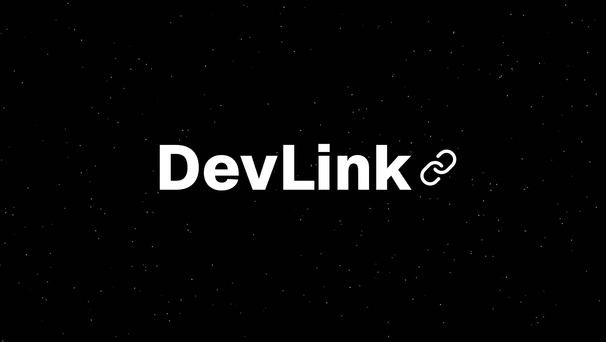

<a href="https://dev-link-iota.vercel.app">
  
  <h1 align="center">DevLink</h1>
</a>

 나만의 프로필 링크를 만들고 공유할 수 있는 서비스 입니다.

## 🌟 주요 기능

- **프로필 만들기**: 나를 소개할 수 있는 커스텀 가능한 프로필 링크를 만들 수 있습니다
- **소셜 로그인**: Google, GitHub 소셜 로그인이 가능합니다
- **프로필 공유**: 프로필 링크 or QR Code 이미지를 다운받아 공유할 수 있습니다
- **QR Scanner**: 공유받은 QR Code 이미지를 QR Scanner를 통해 인식할 수 있습니다
- **반응형 디자인**: 모바일과 데스크톱 환경을 모두 지원합니다
- **다크 모드**: 라이트/다크 모드를 지원합니다

## 🛠 기술 스택

### Frontend

- ReactJS
- NextJS App Router
- TypeScript
- ShadcnUI
- TailwindCSS
- React Hook Form
- Zod
- QR Code & QR Scanner

### Backend & Infrastructure

- Supabase
  - Authentication
  - Database
  - Storage

## 🎯 주요 특징

### Next.js App Router

- 서버 컴포넌트를 활용한 데이터 패칭 및 서버 사이드 렌더링 구현으로 로딩 성능 최적화
- 서버 액션을 사용해 서버 측에서 폼 데이터 및 비동기 데이터 안전하게 처리
- generateMetadata를 활용해 사용자 프로필에 따른 동적 메타데이터 생성 및 SEO 최적화

### 인증 및 보안

- 미들웨어를 통한 인증 상태 확인 및 보호된 라우트 접근 제어
- Row Level Security (RLS)로 데이터베이스 접근 권한 제어 및 Aho-Corasick 알고리즘을 활용한 욕설 필터링 구현
- React Hook Form과 Zod를 활용한 타입 안전한 폼 처리 및 커스텀 에러 메시지 구현
- Google, GitHub OAuth 인증 지원

### 사용자 경험 (UX)

- ShadcnUI를 활용한 직관적이고 부드러운 애니메이션 구현 및 토스트 메시지를 통한 상황별 사용자 피드백 제공
- 시스템 설정에 따른 자동 테마 전환 지원 및 링크 복사, QR 코드 생성 및 다운로드, QR Scanner 기능 구현

### 로딩 및 에러 처리

- Suspense와 Skeleton UI를 활용한 자연스로운 데이터 로딩 처리
- ErrorBoundary와 Error 페이지 구현을 통한 전역 에러 처리
- 404 페이지 및 인증 오류 페이지 구현으로 사용자 경험 개선
