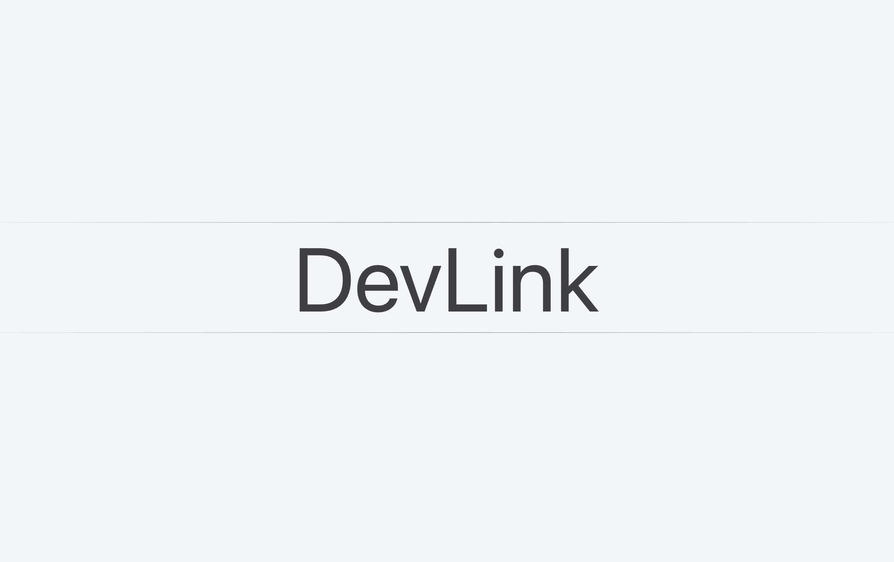

<a href="http://localhost:3000">
  
  <h1 align="center">DevLink</h1>
</a>

 The fastest way to build apps with Next.js and Supabase

  <a href="#helloworld"><strong>Helloworld</strong></a> ·
  <a href="#side"><strong>Side</strong></a> ·
  <a href="#project"><strong>Project</strong></a> ·

 

## Helloworld

- HI
  - Side
  - Project

## Side

> Side

## Project

> Project
